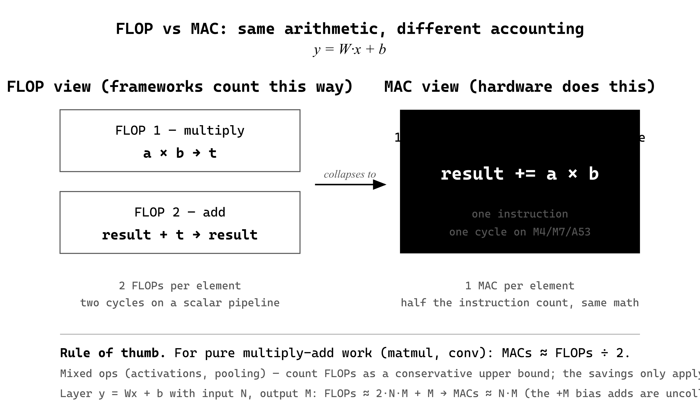
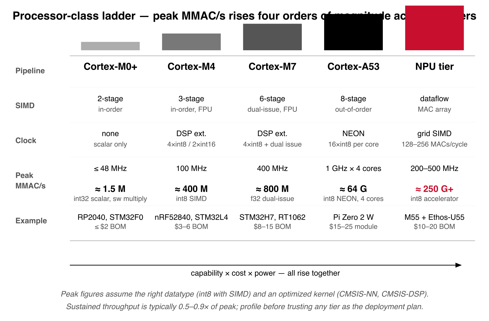
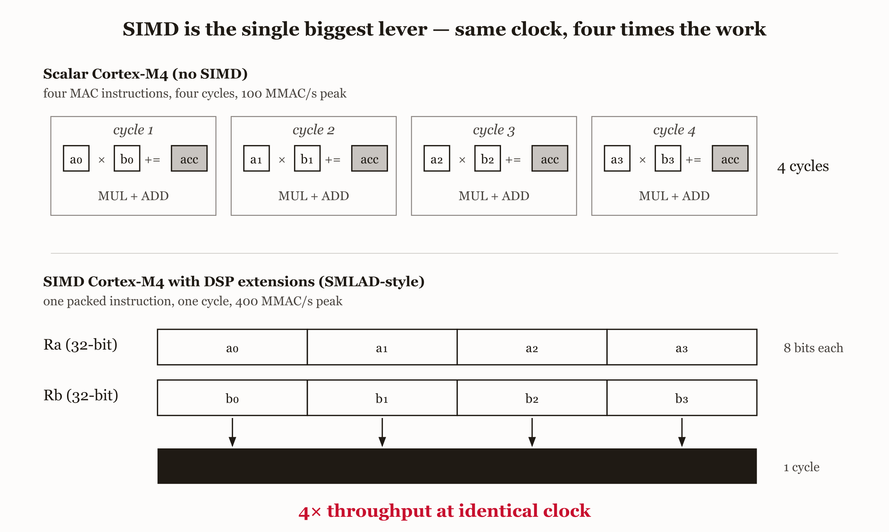
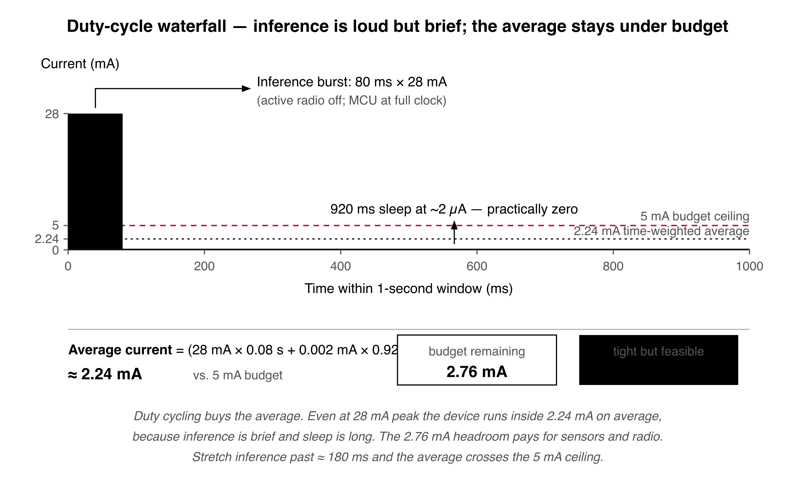

# Chapter 6 — Compute

The model fits in memory. Weights take 600 KB of flash, activations take 140 KB of SRAM, total memory usage leaves 200 KB of headroom. The previous chapter is satisfied. You run the first inference pass and time it: 1,850 ms. The application's deadline is 50 ms.

The model that fits in memory cannot run fast enough to be useful. This is the compute constraint, and unlike a memory failure — which crashes the system in a way you can debug with a stack trace — a compute failure leaves the system *correct but useless*. The result arrives after the object has moved out of frame, after the anomaly has progressed to fault, after the user has given up. Latency violations make the right answer late, which is the same as the wrong answer for any application that has a deadline at all.

The starting point is to translate operation counts into time. Two metrics quantify a network's compute requirement. A *FLOP* is a floating-point operation — an add, subtract, multiply, or divide. A fully connected layer doing $y = Wx + b$ contains *(input size × output size)* multiplications, the same number of additions to accumulate the matrix product, and *(output size)* additions for the bias, for a total FLOP count of about *2 × (input size × output size) + output size*. A *MAC* is a multiply-accumulate: `result += a × b`. Most embedded processors and DSPs and NPUs can do a MAC in one instruction, so the MAC count is the metric that maps directly to hardware capability. The relationship between FLOP and MAC counts is roughly 2 × — each MAC contains both a multiply and an add. Frameworks usually report FLOPs; for pure multiply-add operations like convolution and matmul, divide by 2 to get MACs. For mixed operations (activations, pooling), use the FLOP count as a conservative upper bound.


*Figure 6.1 — FLOP vs MAC equivalence*

Latency is then *total operations / sustained throughput*, where sustained throughput accounts for memory access, cache efficiency, and pipeline utilization. The datasheet's peak throughput is always higher than what you actually get. The ratio between peak and sustained varies from about 0.5× to 0.9× depending on processor, operation, and how well the code is optimized. A Cortex-M7 at 400 MHz with FPU has theoretical peak of 400 MMAC/s — one MAC per cycle. Real code achieves 250–350 MMAC/s sustained because of memory bottlenecks and instruction overhead. A 50 M MAC model: theoretical 125 ms, actual 167 ms. A 33% gap, which is exactly why you must profile on the target rather than trusting the theoretical estimate as the deployment plan.

The other thing that determines whether your latency estimate matches reality is whether the operation is *compute-bound* or *memory-bound*. Compute-bound means execution time is dominated by arithmetic — doubling the clock roughly halves the time. Memory-bound means execution time is dominated by data movement — doubling the clock might cut time by 20% because the processor spends most of its time waiting on memory. A small matmul (64 × 64 by 64 × 64 on a Cortex-M7 with 64 KB of L1 cache) is compute-bound; both matrices fit in cache and every multiply-add executes at peak throughput. A large matmul (512 × 512 by 512 × 512) on the same processor is memory-bound; the matrices total 2 MB, which is far past cache, and each element gets fetched from SRAM repeatedly with bandwidth limiting throughput.

Convolution on microcontrollers is almost always memory-bound. A 3 × 3 convolution on a 96 × 96 image with 32 input channels into 64 output channels does 169 M MACs but moves a lot of bytes; even with input reuse across output channels, the working set comfortably exceeds cache, so each input gets fetched multiple times and bandwidth dominates.


*Figure 6.2 — Roofline model*

The sharp diagnostic is *arithmetic intensity* — operations per byte transferred. High arithmetic intensity (>10 ops/byte) tends to be compute-bound; low (<1 op/byte) tends to be memory-bound. A 64 × 64 matmul with both matrices in cache: 262,144 MACs, 32 KB transferred, 8 ops/byte — borderline, compute-bound with good cache behavior, memory-bound under cache thrashing. A 3 × 3 conv on a 96 × 96 × 32 image: 169 M MACs, 10.6 MB transferred in the worst case with no reuse, 16 ops/byte nominally — but in practice the working set forces re-reads, effective intensity drops to 1–3 ops/byte, and the operation becomes memory-bound. The optimization differs depending on which side you are on. For compute-bound: faster clock, SIMD, hardware accelerator. For memory-bound: tiling and buffer reuse to reduce data movement, on-chip SRAM rather than external memory, quantization to reduce bytes moved per op. Profiling tells you which one applies. If doubling the clock from 100 to 200 MHz nearly doubles performance, you are compute-bound. If it improves performance 10%, you are memory-bound and need to fix the memory pattern, not the arithmetic.

The processor architecture itself shapes how many operations per cycle you can extract. A Cortex-M0+ executes one instruction per cycle in the best case, has no pipeline forwarding, no branch prediction, no SIMD, software-emulated multiplication on parts without a hardware multiplier (32 cycles per multiply). A Cortex-M4 with DSP extensions has a 3-stage pipeline, single-cycle hardware multiply, an FPU, and SIMD instructions that pack four 8-bit ops or two 16-bit ops into one 32-bit instruction — at 100 MHz, peak is 100 MMAC/s for float32 or about 400 M 8-bit MACs/s with SIMD. A Cortex-M7 has a 6-stage superscalar pipeline that can issue two instructions per cycle when they do not conflict, plus a double-precision FPU and decent caches; at 400 MHz, theoretical peak is 800 MMAC/s for single-precision floats with dual-issue, sustained 400–600 MMAC/s. A Cortex-A53 (Raspberry Pi Zero 2 W) has an 8-stage pipeline, out-of-order execution, NEON SIMD that does 16 8-bit MACs per cycle per core; at 1 GHz with 4 cores, theoretical peak is about 64 G 8-bit MACs/s, sustained 30–50 G depending on memory bandwidth.


*Figure 6.3 — Processor-class ladder*

SIMD is the single biggest lever. A scalar Cortex-M4 doing int8 MACs hits 100 M MACs/s. The same chip with SIMD packing four int8 values into a 32-bit register and processing them in parallel hits 400 M MACs/s — a 4× improvement at the same clock speed. *But SIMD requires the inference engine to actually use it.* Most embedded ML frameworks ship optimized kernels for common operations: TFLite Micro uses CMSIS-NN on Cortex-M cores, which exploits SIMD. If your build is using the reference C kernels instead of CMSIS-NN, you are leaving 4–8× of free performance on the table. The way to verify is to disassemble and look for SIMD instructions — `SMLAD`, `SMLALD`, `USAD8` on Cortex-M4; `VMLA.I8`, `VMLA.I16` on Cortex-A. If you only see scalar `MUL` and `ADD`, the optimized kernels are not being called.


*Figure 6.4 — SIMD lane diagram*

Real-time applications care about the worst case, not the average. A system with 50 ms average latency and 500 ms worst case fails a 100 ms deadline because the worst case is what blows the budget. *Worst-case execution time* — WCET — is the maximum time an operation can take under any input, any cache state, any scheduling condition. For traditional embedded code, WCET analysis is mature and tractable; tools like AbsInt aiT or Rapita RVS model the pipeline, cache, and memory and compute the longest possible execution path. For neural network inference, WCET analysis is hard. Networks have many possible execution paths; cache hit-or-miss patterns depend on input data and prior state; modern compilers reorder, unroll, and inline in ways static analysis cannot follow; framework code is large with dynamic dispatch and function pointers that defeat pathfinding tools.

The pragmatic approach to WCET for inference is empirical. Generate inputs intended to maximize the computational path — for fixed-point, fixed-architecture networks, all inputs follow the same path so the variation is small; for networks with attention or early-exit branches, you have to construct adversarial inputs that trigger every branch and avoid every shortcut. Run thousands of test inputs, measure latency, look at the distribution. The maximum observed latency is your empirical WCET estimate. Add safety margin — typically 20–50% above the observed maximum. Verify on actual deployment hardware, not on a development board with different cache or clock. For hard real-time systems where you need provable guarantees — automotive, industrial control, certain medical devices — you have to make the problem easier rather than the analysis stronger: restrict to fixed-path architectures with no dynamic control flow, disable caches or use cache locking to make memory latency deterministic, disable interrupts or run inference at the highest priority. Each of these costs something — model expressiveness, cache performance, or system responsiveness — and is justified only when the safety case demands it. For soft real-time, which is most of embedded AI, empirical WCET with margin is sufficient.

The constraint that runs through everything is the *latency-accuracy trade-off*. Smaller models run faster but predict worse; larger models predict better but run slower. Take three variants of a gesture recognition model: Model A — 2 M parameters, 80 M MACs, 92% accuracy. Model B — 800 K parameters, 35 M MACs, 89%. Model C — 300 K parameters, 12 M MACs, 84%. On a Cortex-M4 at 100 MHz sustaining 60 MMAC/s for int8, Model A takes 1,333 ms, Model B 583 ms, Model C 200 ms. If the deadline is 250 ms, only C passes — but if the application demands 88% accuracy, only A or B pass. You are caught between latency and accuracy.


*Figure 6.5 — Latency–accuracy Pareto plot*

The way out is to find Pareto-optimal models — designs where no other model is both faster and more accurate. Manual search starts from a known-efficient architecture (MobileNetV2, EfficientNet-Lite) and scales it down: drop input resolution, drop channel count via the width multiplier, drop depth. Measure latency and accuracy at each configuration. Plot. The Pareto frontier is the set of points where every other point is worse on at least one axis. Neural Architecture Search automates this — tools like Once-for-All, ProxylessNAS, MnasNet search architectures optimized for specific hardware; you specify the target and the latency budget, NAS proposes architectures that maximize accuracy under the constraints. NAS is expensive (GPU-hours to GPU-days) but for high-volume products where 1% accuracy is worth real money, it pays back. For one-off or low-volume deployments, manual scaling is plenty.

To make the workflow concrete, take a gesture-recognition system on a wearable using a 3-axis accelerometer at 100 Hz, classifying gestures every second on 100 sample windows. The application asks for ≤50 ms latency, ≥88% accuracy on a 20-gesture validation set, and <5 mA average current on a coin cell. Three candidates:

| Model | Architecture | Params | MACs/inference | Accuracy |
|---|---|---|---|---|
| A — 1D CNN | 4 conv + 2 FC | 120,000 (480 KB f32, 120 KB int8) | 18 M | 91.2% |
| B — LSTM | 2 × 64-unit LSTM + FC | 85,000 (340 KB f32, 85 KB int8) | 14 M / step × 100 steps = 1.4 G | 93.5% |
| C — DSCNN | 3 depthwise blocks + FC | 45,000 (180 KB f32, 45 KB int8) | 8 M | 88.9% |

Target hardware: nRF52840, Cortex-M4 at 64 MHz with FPU, sustaining 50 MMAC/s int8 with CMSIS-NN. Latency at 64 MHz: A = 18 M / 50 M = 360 ms, B = 1,400 M / 50 M = 28 seconds (catastrophic — LSTMs are extremely expensive for long sequences on microcontrollers), C = 8 M / 50 M = 160 ms. None meets 50 ms. Boost the clock to 128 MHz, sustained throughput roughly doubles to 100 MMAC/s: A = 180 ms, C = 80 ms. Still over 50 ms.

Go back to the product team. The deadline of 50 ms came from "that feels responsive." 100 ms is actually acceptable for this application. Renegotiate. At 128 MHz with a 100 ms deadline, Model C passes — 80 ms latency, 88.9% accuracy, both inside the application requirement. Models A and B remain disqualified.

Power check at 128 MHz: active current rises from 15 mA at 64 MHz to about 28 mA at 128 MHz. Inference takes 80 ms; the device sleeps the remaining 920 ms each second. Average current: (28 × 0.08 + 0.002 × 0.92) / 1 = 2.24 mA. The 5 mA budget allows 2.24 mA for inference and leaves 2.76 mA for sensor acquisition and communication, which is tight but feasible.

The conclusion is that Model C is the only viable choice on this hardware, and only with the relaxed deadline. Models A and B fail latency even with clock boost. Model B is disqualified entirely — 28 seconds is unusable. If the product team cannot accept 100 ms, the hardware is insufficient and you need to upgrade (an STM32H7 at 480 MHz would bring Model C's latency to roughly 20 ms), add an accelerator (Cortex-M55 plus Ethos-U55 NPU), or shrink the model further at additional accuracy cost. *Without this analysis, you would discover the failure after manufacturing.*


*Figure 6.6 — Latency budget waterfall*

When the latency budget cannot be met, four moves remain. Upgrade the hardware to a faster processor or add an accelerator — costs more, draws more power, but solves compute definitively. Reduce the model's operation count by shrinking the architecture and pay the accuracy cost. Relax the latency requirement, which sometimes works if the original number was set by feel rather than by physics. Reject AI for the application — if no model meets both the accuracy and latency floors on feasible hardware, AI is the wrong tool, and a hand-tuned threshold classifier or a decision tree probably gets you there. The compute constraint is unforgiving in a way the memory constraint is not. Memory has external storage as an escape valve, at a cost. Compute has no equivalent — either the processor can do the operations in time, or it cannot, and optimization gives you 2–10× improvement, not 100×. If you need 100×, you have chosen the wrong hardware or the wrong model. The next chapter looks at what happens when compute is fast enough but the energy budget says no.

---

## LLM Exercise — Chapter 6: Compute

**Project:** TinyML Feasibility Toolkit
**What you're building this chapter:** The compute verdict module — same pattern as memory, but comparing predicted latency against the latency constraint and emitting processor-class upgrade recommendations when the budget doesn't close.
**Tool:** Claude Code

---

**The Prompt:**

```
Add src/tinyml_feasibility/compute.py to the tinyml-feasibility toolkit.

Frozen ComputeVerdict dataclass:
- predicted_latency_ms: float
- latency_budget_ms: float
- headroom_pct: float
- arithmetic_intensity: float (MACs per byte of activation traffic — flags memory-bound vs compute-bound)
- verdict: Literal["FITS", "TIGHT", "FAILS"]
- mitigations: list[str]
- upgrade_path: list[Target] (targets in TARGETS that would close the budget, ranked by cost)
- to_markdown() method emits a Compute section matching Chapter 14's shape

Public function:
`assess_compute(model: ModelSummary, target: Target, app: Application) -> ComputeVerdict`

Implementation:
- predicted_latency_ms comes from profiling.predict_pipeline (chapter 4)
- headroom_pct = (latency_budget - predicted) / latency_budget * 100
- arithmetic_intensity = mac_count / (largest_activation_elements * 2) (rough; flags <1.0 as likely memory-bound)
- verdict: FITS if headroom > 20%; FAILS if headroom < 0; TIGHT otherwise
- mitigations from chapter 6's repertoire:
 - if compute-bound: "Boost clock", "Add SIMD-optimized kernel (CMSIS-NN)", "Reduce model MAC count via pruning"
 - if memory-bound: "Reduce activation footprint", "Add data prefetch", "Reduce input resolution"
- upgrade_path: filter TARGETS to those whose predicted latency on this model is < latency_budget; sort by cost_usd ascending, take top 3

CLI:
- `tinyml-feasibility check-compute --app <yaml> --target <name> --model <path>` prints ComputeVerdict and the upgrade_path table

Tests:
- test_fits_fast_processor — STM32H7 + small model, expect FITS
- test_fails_slow_processor — STM32L4R5 + heavy MobileNet, expect FAILS, upgrade_path includes STM32H7
- test_arithmetic_intensity_flag — model with very small activations and many MACs flagged compute-bound
```

---

**What this produces:** `tinyml-feasibility check-compute --app jaguar.yaml --target STM32L4R5 --model jaguar_dscnn.tflite` returns predicted latency, headroom, verdict, and a ranked list of next-tier targets that would close the budget if the current one fails.

**How to adapt this prompt:**
- *For your own project:* The upgrade_path is your shopping list when the first hardware pick fails. Take the cheapest target that fits.
- *For ChatGPT / Gemini:* Works as-is.
- *For Claude Code:* Best fit. The verdict pattern is now established; this chapter reinforces it.
- *For a Claude Project:* Add the verdict-pattern template to the system prompt — chapters 7–10 will reuse the same shape.

**Connection to previous chapters:** Consumes ModelSummary (3), Target (2), Application (1), and `profiling.predict_pipeline` (4). The verdict pattern from chapter 5 now repeats; chapter 14 will aggregate them.

**Preview of next chapter:** Chapter 7 adds `power.py` — energy-balance equation, average power, battery life, and duty-cycle recommendations. Power is the constraint where most embedded AI projects actually break.

---

## AI Wayback Machine

The ideas in this chapter didn't appear from nowhere. **Frances Allen** invented the techniques that turn a high-level loop into the SIMD instructions you're now counting cycles on — vectorizing compilers, decades before CMSIS-NN.

**Run this:**

```
Who was Frances Allen, and how does her work on vectorizing compilers and program optimization connect to running int8 inference on a SIMD-equipped microcontroller? Three paragraphs. End with the single most surprising thing about her career.
```

→ Search **"Frances E. Allen"** on Wikipedia. See what the model got right, got wrong, or left out.

**Now make the prompt better.** Try one of these:

- Ask it to explain what a vectorizing compiler does, with one tiny C example
- Ask it to compare Allen's compiler optimizations to what CMSIS-NN does for a Cortex-M4
- Add a constraint: "Answer as if you're writing the dedication page of a compiler textbook"

What changes? What gets better? What gets worse?
