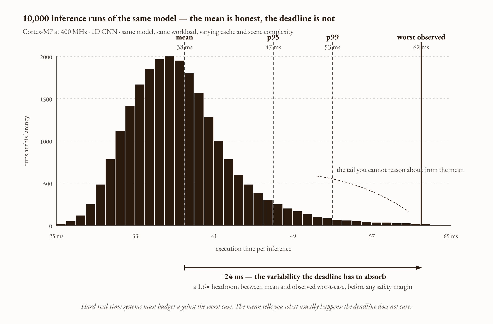

# Chapter 10 — Real-Time AI

On March 18, 2018, an autonomous test vehicle operated by Uber struck and killed Elaine Herzberg, a pedestrian crossing a street in Tempe, Arizona. The vehicle's perception system — LIDAR, radar, and camera sensors feeding neural-network-based object detection — *identified the pedestrian 5.6 seconds before impact*. The decision logic classified the detection as a false positive and suppressed the braking command. By the time the system reclassified the object as a pedestrian requiring emergency braking, 1.3 seconds remained, which was insufficient stopping distance at the vehicle's speed.

The neural network did not fail to detect. The network detected. What failed was that the system lacked deterministic worst-case bounds for the perception-to-action pipeline, the inference time varied with scene complexity, and the decision logic could not bound the latency. When inference ran long, the action arrived too late.

This is the real-time AI problem in its sharpest form. Neural networks are powerful and non-deterministic. Their execution time varies with input data, cache state, memory contention, and scheduling. For *soft* real-time applications — smart thermostats, wearables, consumer electronics — variable latency is fine, the user experience just degrades a bit when inference runs long. For *hard* real-time applications — automotive safety, industrial control, medical alarms — missing a deadline is a system failure that can cause physical harm. The chapter is about how to evaluate which kind of real-time you have, and what design patterns let AI live inside hard real-time systems without becoming the part that breaks them.


*Figure 10.1 — Hard, firm, and soft real-time. Three deadlines, three consequences of a miss. The class chooses the architecture before the model does.*

A real-time system is one whose correctness depends on *when* output arrives, not just on what the output is. The classifications matter. *Soft* real-time prefers deadlines but tolerates misses — video stutters when frames are delayed but the system continues. A smart thermostat running gesture recognition is soft real-time; a 200 ms inference where the budget was 100 ms makes the response feel sluggish, not catastrophic. *Firm* real-time tolerates occasional misses but treats late results as useless — a radar processor whose result arrives after the next radar sweep produces output that is still numerically correct but no longer relevant. A small fraction of misses (say <0.1%) is acceptable. *Hard* real-time admits no misses; a missed deadline is a system failure. Automotive airbag controllers — deployment within 10–20 ms of crash detection or the airbag is too late to protect the occupant. Industrial safety systems shutting down machinery when faults are detected — late detection allows the fault to progress to catastrophic failure. Hard real-time is what the Uber case was, and what the rest of this chapter is about.


*Figure 10.2 — Ten thousand runs, same model. The mean is honest, the tail is what the deadline has to absorb.*

Neural network inference is structurally hard to put inside a hard real-time system because of four sources of non-determinism. *Input-dependent execution paths* — early-exit networks process easy inputs in 50 ms and hard inputs (low confidence, all 10 layers) in 200 ms; attention mechanisms compute dynamic weights based on input content, so the operation count depends on what is being attended to; even ReLU implemented with conditional branching introduces small variability per element through branch-prediction effects on deeply pipelined cores. *Cache and memory effects* — a memory access takes 1–2 cycles if the data is in cache and 10–100 cycles if it has to come from main memory, and whether you hit or miss depends on what was accessed recently, what other tasks evicted from the cache, and the spatial pattern of the current accesses. A convolutional layer on a smooth image has different cache behavior than the same layer on a noisy image; the variation can be 10–30% of execution time. *RTOS scheduling and preemption* — on systems running an RTOS, inference can be preempted by higher-priority tasks; the wall-clock time becomes inference time plus preemption time, and preemption time is non-deterministic because it depends on when interrupts arrive, how long handlers run, and which other tasks are ready. Bounding it requires analyzing the entire task system, not just the inference task. *Framework overhead* — TFLite Micro, PyTorch Mobile, ONNX Runtime add abstraction layers (graph interpreters, dynamic dispatch, memory managers); dynamic memory allocation has variable execution time depending on heap fragmentation, virtual function calls have variable latency depending on instruction cache, and any logging or profiling code adds overhead. For safety-critical applications, frameworks with dynamic allocation and complex control flow are unsuitable; the engine has to be statically analyzable, which means no dynamic allocation, no recursion, no unbounded loops.

Worst-case execution time analysis aims to compute the longest possible execution time for a piece of code, under any input and any system state, without running every input. Traditional WCET tools — AbsInt aiT, Rapita RVS, SWEET — model the processor's pipeline, cache, and memory; build a control-flow graph; find the longest path; return an upper bound. This works well for simple embedded code with explicit control flow. It fails for neural network inference for predictable reasons: path explosion (a 20-layer network with 10 paths per layer has 10²⁰ paths and you cannot enumerate them), indirect control flow (frameworks use function pointers and dynamic dispatch the analyzer cannot follow), complex cache behavior (convolutional layers have access patterns that depend on input dimensions, stride, padding, and channels — modeling cache for all configurations is intractable), and floating-point variability (IEEE 754 is not associative, compilers reorder, and some FPUs have variable latency on denormals or NaNs).

Static WCET for neural networks is an open research problem. The pragmatic workarounds are five. *Empirical WCET* — run the model on thousands of inputs, take the maximum observed time, add 20–50% safety margin. This is not a proof, but it is what most projects actually do. *Restrict the architecture* — use only layers with data-independent execution paths, ban early exits, dynamic attention, and conditional branches; this makes static analysis feasible at the cost of model expressiveness. *Disable caches or use cache locking* — lock weights and activations into deterministic memory so timing is predictable; this sacrifices performance for predictability. *Run inference at highest priority with interrupts disabled* — eliminate preemption and interrupt latency from the variability budget; this trades latency on other tasks for determinism on inference. *Use accelerators with provable timing* — automotive-grade NPUs from NXP and Renesas are designed without caches and without dynamic control flow specifically so their timing is deterministic, and they ship with WCET guarantees for fixed-point models. None of these is a complete solution. Each trades off expressiveness, performance, or cost to gain determinism.

Safety-critical AI introduces a second axis of difficulty: the relevant *standards*. IEC 61508 is the generic functional-safety standard for electrical and electronic systems, with Safety Integrity Levels 1 through 4 (SIL 4 most stringent). ISO 26262 is the automotive adaptation, with Automotive Safety Integrity Levels A through D (ASIL D most stringent). IEC 62304 is medical-device software. DO-178C is avionics software. They share a common framework: hazard analysis identifies failure modes; risk classification ranks them by severity; safety requirements specify maximum tolerable failure rates (ASIL D demands less than 10⁻⁸ failures per hour); verification proves the system meets the requirements through testing, formal methods, or certification.

Neural networks pose specific challenges. They have *blackbox behavior* — their behavior emerges from learned weights, you cannot inspect them and conclude *this will always detect pedestrians within 5.6 seconds* the way you can inspect a threshold-based detector. They have *no formal specification* — traditional software has *input → expected output*; neural networks have training data and statistical performance metrics, and 95% accuracy is not a safety guarantee for an application where the 5% includes catastrophic misses. They are *dataset-dependent* — a network trained without edge cases will fail on edge cases in deployment, and proving completeness of a training set is impossible. They are *adversarially vulnerable* — networks can be fooled by inputs designed to cause misclassification, and a stop sign with specific stickers can read as a speed-limit sign to some networks. The standards are being extended to address AI specifically — ISO/PAS 21448 (SOTIF) addresses the case where the system behaves as designed but the design is insufficient (a pedestrian detector never trained on wheelchairs); UL 4600 covers autonomous vehicles; ISO/TR 5469 gives guidance on AI in road vehicles — but they are not yet mature, and certifying an AI component for ASIL D is still essentially a research problem. The current practice is to use AI in non-safety-critical roles and keep safety-critical decisions in traditional, certifiable software.


*Figure 10.3 — Five design patterns. The AI is on every diagram; the safety guarantee is the block next to it.*

Five design patterns let you put AI inside real-time systems without putting it in the critical path. *AI as advisory, not command*: the AI provides a recommendation; a deterministic supervisor with hard real-time guarantees and a proven safety envelope makes the final decision. The AI improves performance — fewer false positives, better classification — but the safety fallback is independent of it. An industrial robot uses AI for defect detection but also has a hardware limit switch; if the AI misses, the limit switch stops the robot. *Bounded execution with rejection*: hardware timer starts when inference begins; if the timer expires before inference completes, terminate inference and return *unknown*; the application handles *unknown* as a safe state. The AI never violates the deadline; the new failure mode is rejected inferences, which the system has to be designed to handle safely. *Confidence gating*: the model outputs a classification *and* a confidence score; only high-confidence predictions trigger action. A pedestrian detector at 98% confidence triggers braking; the same detector at 60% confidence flags for human review and does not brake. This reduces catastrophic false positives at the cost of more false negatives, and the threshold is itself a safety parameter set conservatively for life-critical applications. *Redundant inference with voting*: run multiple models with different architectures and training sets in parallel and use majority voting; act when two of three agree, reject when all three disagree. Triples inference cost in latency, power, and memory, so it is only viable when resources permit, but it dramatically improves robustness to adversarial inputs and model-specific failure modes. *Hierarchical safety layers*: layer the safety mechanisms so AI failure is caught by a subsequent simpler check. An autonomous vehicle's perception stack might be: AI pedestrian detection (high accuracy, complex, non-deterministic), then a rule-based threshold on LIDAR distance (low accuracy, deterministic, proven safe — if AI misses, this still triggers braking on any object within 5 meters), then a hardware bumper sensor as the ultimate fallback. Each layer is progressively simpler and more conservative. The AI optimizes for performance; the safety guarantee comes from the layers below.


*Figure 10.4 — Six failure modes against the ASIL D bar. Five of six fail it unmitigated. The mitigation column, not the model, closes the gap.*

Failure-mode analysis for AI components has to enumerate all the ways the AI can produce wrong outputs and classify them by consequence. *False negatives* — the model fails to detect a present condition (a pedestrian detector misses a pedestrian, no braking, collision; consequence catastrophic). *False positives* — the model detects a condition that is not present (a fault detector flags a healthy motor, unnecessary shutdown, production loss; consequence economic but not safety-critical). *Latency violations* — correct output, too late (collision detector identifies an obstacle at 5 meters but inference takes 500 ms and the vehicle is now at 2 meters; consequence catastrophic). *Adversarial misclassification* (stop sign with stickers reads as speed limit; consequence catastrophic). *Distribution shift* — the model encounters inputs outside its training distribution (a pedestrian detector trained only on adults misses children or wheelchair users; consequence catastrophic). *Numerical instability* (quantization or fixed-point arithmetic accumulates error and a regression model predicts -5% where the true value is +5%; consequence depends on the application). For each, you estimate probability from validation testing or field data, classify severity, check whether probability × severity is within the acceptable risk threshold, and apply mitigations if not. ASIL D allows fewer than 10⁻⁸ failures per hour; if your AI has a 1% false-negative rate, it is failing 10,000× too often, and you have to either improve to 99.999999% accuracy (impossible for most tasks) or add redundancy and fallbacks so AI failures are caught before they cause harm.

To make the patterns concrete, work an actual integration. A high-speed CNC milling machine running at 10,000 RPM, control loop at 1 kHz (every 1 ms), anomaly must trigger shutdown within 5 ms to prevent tool breakage. The AI: 1D CNN, 3 conv + 2 FC layers, 80,000 int8 parameters, 12 M MACs, measured latency 35–55 ms on a Cortex-M7 at 400 MHz. The latency exceeds the 5 ms deadline by an order of magnitude. Direct integration is impossible.

Try *bounded execution with rejection* — set a 5 ms timeout, abort if inference does not finish. Inference takes 35 ms minimum. Every inference aborts. The AI provides no value.


*Figure 10.5 — CNC integration timeline. RMS trips at +2 ms, AI advisory lands at +38 ms. The deadline is met by the deterministic detector, not the model.*

Try *AI as advisory*. Run inference asynchronously every 50 ms instead of every 1 ms. Each inference updates a `fault_probability` variable. The hard real-time control loop reads `fault_probability` every 1 ms and triggers shutdown if it exceeds a threshold. Control loop deadline 1 ms; a variable read and threshold compare takes well under 10 µs, with 100× margin. AI task has no hard deadline because it is advisory; 55 ms of inference time is fine. False negative on AI: `fault_probability` stays low, the machine continues, the fault progresses until detected by other means — bad but deferred. False positive on AI: `fault_probability` goes high, machine stops, production loss but no safety harm. AI hangs or crashes: a watchdog timer resets `fault_probability` to 0 if the AI does not update it within 100 ms, preventing a stuck AI from causing a spurious shutdown.

Now layer hierarchy. Add a deterministic backup detector inside the control loop: compute RMS vibration over the last few samples, compare to a conservative threshold every 1 ms, set `fault_flag` immediately if exceeded. Add a hardware current sensor on the motor that trips the supply if current exceeds safe limits, indicating mechanical seizure independent of any software. Control-loop logic becomes: if `fault_flag || fault_probability > 0.95`, stop. The AI provides early warning of incipient faults at 35–55 ms latency. The rule-based detector provides conservative deterministic backup at <1 ms. The hardware trip is the ultimate fallback. Defense in depth, AI improves performance, AI failure is tolerable.

The AI is successfully integrated into a hard real-time system *by removing it from the hard real-time path*. The control loop meets its 1 ms deadline. The AI improves fault detection. Safety is guaranteed by deterministic fallbacks that do not depend on AI.

Some applications cannot tolerate non-deterministic AI even with these patterns, because the certification regime they live under will not certify a system whose components are not formally verifiable. Nuclear reactor control, aircraft primary flight control under DO-178C, life-critical medical actuation under IEC 62304 — these constrain AI to non-critical roles: diagnostics and monitoring (flag anomalies for human review without automated action), optimization (tune parameters for efficiency within safety bounds enforced deterministically), or post-processing (analyze logged data after the fact). The hard boundary is: if you cannot prove the AI component meets WCET and reliability requirements for the applicable standard, the component cannot deploy in a safety-critical role. Use AI where it adds value without adding risk; keep the safety guarantee on the parts of the system that can be made provable.

That closes Part II. The next chapter starts Part III, where the model is no longer a fixed input to the constraint analysis but a design variable — selecting models for deployment constraints rather than evaluating fixed models against them.

---

## LLM Exercise — Chapter 10: Real-Time AI

**Project:** TinyML Feasibility Toolkit
**What you're building this chapter:** A real-time verdict module that classifies an application's deadline class (soft / firm / hard), checks WCET against the deadline, and recommends a design pattern when AI is in a safety-critical loop.
**Tool:** Claude Code

---

**The Prompt:**

```
Add src/tinyml_feasibility/realtime.py to the tinyml-feasibility toolkit.

Frozen RealTimeVerdict dataclass:
- real_time_class: Literal["soft", "firm", "hard"]
- predicted_wcet_ms: float (95th-percentile latency × 1.5 safety factor for hard real-time)
- deadline_ms: float
- headroom_pct: float
- safety_class: Literal["non-critical", "iec61508_sil1", "iec61508_sil4", "iso26262_asilA", "iso26262_asilD", "iec62304_classB", "iec62304_classC", "do178c_levelA"]
- design_pattern: Literal["advisory", "bounded_inference", "confidence_gating", "voting", "hierarchical_fallback", "exclude_ai"]
- justification: str
- verdict: Literal["FITS", "TIGHT", "FAILS", "REQUIRES_PATTERN_CHANGE"]
- mitigations: list[str]
- to_markdown() emits a Real-Time section matching Chapter 14's shape

Public functions:
- `assess_realtime(model: ModelSummary, target: Target, app: Application, latency_estimate: LatencyEstimate) -> RealTimeVerdict`
- `recommend_design_pattern(safety_class: str, headroom_pct: float, real_time_class: str) -> str` — returns a pattern name with rationale

Implementation:
- predicted_wcet_ms = latency_estimate.total_ms × 1.5 (conservative — real WCET requires measurement on target)
- For hard real-time AND safety_class in (iso26262_asilD, do178c_levelA): if AI cannot prove WCET deterministically, design_pattern = "exclude_ai" with justification
- For hard real-time + lower safety class: design_pattern = "hierarchical_fallback" — AI advisory, deterministic fallback enforces safety
- For firm real-time: design_pattern = "confidence_gating" — discard low-confidence predictions
- For soft real-time: design_pattern = "advisory" — AI suggests, human or downstream system decides
- Add app fields if missing: safety_class (str)

CLI:
- `tinyml-feasibility check-realtime --app <yaml> --target <name> --model <path>` prints RealTimeVerdict

Tests:
- test_soft_real_time_advisory — soft class, expect "advisory" pattern
- test_hard_asild_excludes_ai — hard real-time + ASIL-D, expect "exclude_ai"
- test_firm_with_low_headroom_gates — firm class + headroom < 20%, expect "confidence_gating"
- test_hard_with_fallback — hard real-time + non-ASIL-D safety, expect "hierarchical_fallback"
```

---

**What this produces:** A real-time verdict that names the safety class, recommends a design pattern from chapter 10's repertoire, and flags when AI must be excluded from the safety-critical path.

**How to adapt this prompt:**
- *For your own project:* The safety_class field needs honest input — it determines everything. Misclassify your application as `non-critical` when it's actually ASIL-B and the toolkit will hand you a deployment that won't certify.
- *For ChatGPT / Gemini:* Works as-is.
- *For Claude Code:* Best fit. The pattern selection is rule-based, easy to test.
- *For a Claude Project:* Pin the safety-class table to the system prompt; it gets read by chapter 14's report generator.

**Connection to previous chapters:** Reads LatencyEstimate (4), Application (1, with safety_class). Produces the design-pattern recommendation that chapter 14's report will surface.

**Preview of next chapter:** Chapter 11 adds `compare.py` — multi-model Pareto comparison. Given N candidate models, rank them by feasibility-margin and accuracy and identify the Pareto frontier.

---

## Prompts

Use these prompts with Claude to generate interactive D3 v7 versions of the
figures in this chapter. Each produces a standalone HTML file you can open
in a browser and modify freely.

**Prerequisites:** Load `brutalist/CLAUDE.md` and `brutalist/DESIGN.md` into
your Claude project context before using these prompts. They define the stack,
naming conventions, color system, and typography the figures use.

---

### Figure 10.1 — Real-time taxonomy

Build a three-column comparison figure for the real-time taxonomy. Columns: HARD, FIRM, SOFT. Rows: class header, deadline tolerance, example application, consequence of miss. Data per column — HARD: zero tolerance / airbag controller 10–20 ms / catastrophic. FIRM: less than 0.1% miss budget / radar sweep processor / useless output. SOFT: missed but still useful / gesture thermostat 200 ms over 100 ms budget / sluggish UX. Channels: column = class (categorical, ordered by strictness); row = attribute (categorical). Color: class header fill uses a luminance ramp from var(--color-ink) for HARD through #404040 for FIRM to #787878 for SOFT — encodes strictness as luminance. Detail cells use var(--color-white) with a var(--color-border) hairline. Add a footer band reading "WHERE NON-DETERMINISTIC AI CAN LIVE" with one sentence per column. Standalone HTML, D3 v7 from the pinned CDN, EB Garamond / Inter / JetBrains Mono Google Fonts, inline CSS and JS, role="img" + title + desc, ResizeObserver, tooltip on hover of each class header naming where AI can live in that class. Respect prefers-reduced-motion.

> Reference implementation: `d3/chapter-10-real-time-ai-fig-01.html`

---

### Figure 10.2 — Latency distribution histogram

Build a histogram of CNN inference latencies on a Cortex-M7. Synthesize 40 one-millisecond bins from 25 ms to 64 ms, peaking near 36 ms with a long right tail to 62 ms. Channels: x is execution time in ms (linear, zero baseline not required because position is the channel and zero is not meaningful for elapsed time); y is run count at that latency (linear, zero baseline). Bars in var(--color-ink). Add four vertical marker lines: mean at 38 ms, p95 at 47 ms, p99 at 53 ms, worst observed at 62 ms — first three dashed in var(--color-secondary), worst observed solid in var(--color-ink) at 1.5 px. Each marker labeled with its name and ms value above the plot. Add a horizontal annotation arrow under the x-axis spanning mean to worst observed with the label "+24 ms — variability the deadline must absorb." Standalone HTML, D3 v7 from the pinned CDN, EB Garamond / Inter / JetBrains Mono Google Fonts, var(--color-*) tokens with dark-mode @media, role="img" + title + desc, ResizeObserver, tooltip on each bar showing ms and count, prefers-reduced-motion respected.

> Reference implementation: `d3/chapter-10-real-time-ai-fig-02.html`

---

### Figure 10.3 — Five design patterns

Build a 5-card grid figure of real-time AI design patterns. Cards arranged 3 across on wide screens, 1 across on narrow. Each card carries an eyebrow label (PATTERN 1–5), a title in EB Garamond, an embedded SVG block diagram, and a one-line mitigation under it. Patterns: (1) Advisory — AI box → supervisor box → actuator. (2) Bounded execution — AI + timer branches into "use result" and "UNKNOWN" then to a safe-state actuator. (3) Confidence gating — AI emits class + score; branches "≥ 0.98 act" and "< 0.98 flag" to actuator. (4) Voting — three AI models feed a "2-of-3 vote" supervisor to the actuator. (5) Hierarchical — three stacked layers: AI perception, rule-based threshold, hardware trip. Channels: position = data flow direction; container shape = block role (AI = gray ai-rect; supervisor = white safe-rect with heavy ink stroke; actuator = filled ink act-rect). Card border highlights to var(--color-red) on hover. Standalone HTML, D3 v7 from the pinned CDN, EB Garamond / Inter Google Fonts, var(--color-*) tokens, role="img" + aria-label per card, ResizeObserver via CSS grid, tooltip naming the mitigated failure mode, prefers-reduced-motion respected.

> Reference implementation: `d3/chapter-10-real-time-ai-fig-03.html`

---

### Figure 10.4 — AI failure-mode matrix

Build a six-row failure-mode matrix as an SVG grid (not a markdown table). Rows: false negative, false positive, latency violation, adversarial misclassification, distribution shift, numerical instability. Columns: FAILURE MODE (name + example), TYPICAL PROBABILITY, SEVERITY, ASIL D OK?, REQUIRED MITIGATION. Channels: row = failure mode (categorical, ordered by severity); column = attribute; cell fill = a five-step warm-grayscale severity ramp from var(--color-white) at severity 1 through #D4D4D4, #787878, #404040, to var(--color-ink) at severity 4. Text color flips to var(--color-white) on dark cells (severity ≥ 3) for AAA contrast. Row name cells stay white with a 6 px left bar in the row's severity color. Add a SHADING legend under the matrix mapping the four darker steps to "fails ASIL D unmitigated," "catastrophic when triggered," "moderate / app-dependent," "economic, not safety." Standalone HTML, D3 v7 from the pinned CDN, EB Garamond / Inter / JetBrains Mono Google Fonts, var(--color-*) tokens, role="img" + title + desc, every cell tabindex="0" + aria-label, tooltip on hover showing row name, column attribute, value, and mitigation. ResizeObserver, prefers-reduced-motion respected.

> Reference implementation: `d3/chapter-10-real-time-ai-fig-04.html`

---

### Figure 10.5 — CNC milling integration timeline

Build a three-track timeline figure for the CNC milling integration. Time axis: 0 to 60 ms after fault onset. Track 1 (top): 1 kHz control loop — render 60 evenly spaced tick marks every 1 ms. Track 2 (middle): asynchronous AI inference — render one completed inference bar from 0 to 38 ms (solid stroke) and a scheduled bar from 50 to 60 ms (dashed stroke); place a filled circle at +38 ms labeled "fault_probability ← 0.97." Track 3 (bottom): 1 kHz RMS backup detector — render 60 tick marks every 1 ms in var(--color-secondary), with a filled var(--color-ink) circle at +2 ms labeled "fault_flag ← true." Three vertical event lines spanning all tracks: fault onset at 0 ms (solid heavy), 5 ms deadline (dashed), AI advisory at 38 ms (dashed, secondary color). Channels: x = time (linear, zero baseline); y = track (categorical); mark type = event kind. Track labels in the left margin: eyebrow + title + sub. Outcome callout below the axis: "Shutdown triggered by RMS at +2 ms — well inside the 5 ms budget. AI advisory arrives at +38 ms and would have missed." Standalone HTML, D3 v7 from the pinned CDN, EB Garamond / Inter / JetBrains Mono Google Fonts, var(--color-*) tokens, role="img" + title + desc, inference bars tabindex="0" + aria-label with tooltip on hover, ResizeObserver, prefers-reduced-motion respected.

> Reference implementation: `d3/chapter-10-real-time-ai-fig-05.html`

---

## AI Wayback Machine

The ideas in this chapter didn't appear from nowhere. **Chung Laung "C.L." Liu** co-authored the 1973 paper on rate-monotonic scheduling — the math behind every hard-real-time system that has to guarantee a deadline, including the AI ones.

**Run this:**

```
Who was C.L. Liu, and how does his work with James Layland on rate-monotonic scheduling connect to today's hard real-time embedded AI systems? Three paragraphs. End with the single most surprising thing about his career.
```

→ Search **"Chung Laung Liu"** on Wikipedia. See what the model got right, got wrong, or left out.

**Now make the prompt better.** Try one of these:

- Ask it to explain rate-monotonic scheduling in plain language, with one tiny example
- Ask it to compare the Liu-Layland bound (~69%) to the safety margin you'd want when an AI inference task shares a CPU with control loops
- Add a constraint: "Answer as if you're writing a footnote in a real-time systems textbook"

What changes? What gets better? What gets worse?
